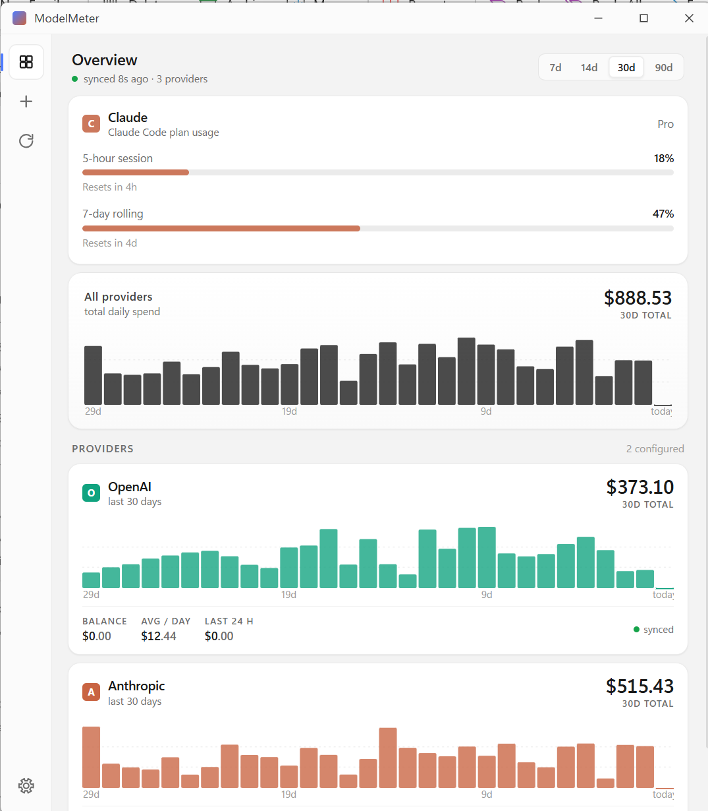

# ModelMeter

A free, open-source desktop application that aggregates AI provider API usage and billing data into a single unified view.

## What it does

ModelMeter polls each provider's usage and billing endpoints on a configurable schedule and shows balances, cost breakdowns, and spending trends in one customisable dashboard. No code instrumentation, no traffic proxy, no third-party data routing — your API keys stay on your machine and only ever talk to the provider that owns them.

## Supported providers

| Provider | Status | Auth method |
|---|---|---|
| OpenAI | v1 | Admin API key |
| Anthropic | v1 | Admin API key |
| Claude (Claude Code) | v1 | Claude Code OAuth — no API key required |

## Setting up Claude (Claude Code)

The Claude provider shows your Claude Pro or Max plan's rate-limit consumption — the same session and weekly usage percentages that Claude Code's `/usage` command displays.

**Requirements:**

- Claude Code installed on your machine (any installation method — npm global, winget, Scoop, etc.)
- A Claude Pro or Max subscription
- Signed in to Claude Code at least once (so the OAuth credentials exist at `~/.claude/.credentials.json`)

**No API key is needed.** ModelMeter reuses the OAuth credentials that Claude Code already stored when you logged in. The credentials file is never modified — ModelMeter reads it read-only.

**Adding the provider:**

1. Open **Providers** → **Add provider** → select **Claude**
2. ModelMeter will detect your Claude Code installation automatically and pre-fill the path. If it cannot find it, enter the full path to the `claude` executable (e.g. `C:\Users\you\AppData\Roaming\npm\claude.cmd`)
3. Click **Validate** — this confirms the executable runs and your credentials are valid
4. Enter a display name and click **Add provider**

**What is displayed:**

The Dashboard shows two progress bars, updated on demand (on load and on each manual refresh):

- **Session (5hr)** — percentage of the 5-hour rolling usage window consumed, with time until it resets
- **Weekly (7 day)** — percentage of the 7-day usage window consumed, with time until it resets

If your session expires, re-authenticate by opening Claude Code.

## Why administrative API keys are required

This section applies to OpenAI and Anthropic only. The Claude (Claude Code) provider uses a different authentication method and does not require an admin key.

ModelMeter reads usage and billing data from each provider's management-tier APIs — not the inference endpoints that regular API keys are scoped to.

A standard API key (an OpenAI `sk-proj-…` project key, a regular Anthropic `sk-ant-api-…` key) only authorizes inference calls. It cannot read your organization's usage metrics or cost report because those endpoints sit behind a separate permission boundary that only admin-tier credentials can cross.

When you enter a non-admin key, ModelMeter detects the insufficient permissions during key validation and shows you the correct URL to create an admin key for that provider.

## Getting your admin key

### OpenAI

OpenAI uses organization-level Admin API keys (identifiable by the `sk-admin-…` prefix), which are distinct from project keys (`sk-proj-…`) and standard user keys (`sk-…`). Only an admin key can call the `/v1/organization/usage` and `/v1/organization/costs` endpoints that ModelMeter depends on.

Create one at: https://platform.openai.com/settings/organization/admin-keys

**Use a read-only key.** When creating the key in the OpenAI console you will be offered a read-only option. Always choose read-only. ModelMeter only ever reads data — it never writes — and a read-only key cannot be used to modify your organization, rotate other keys, or take any destructive action if it were ever compromised.

### Anthropic

Anthropic uses Admin API keys (`sk-ant-admin-…` prefix), available only on organization accounts — personal accounts do not have access to the Admin API at all. Standard API keys (`sk-ant-api-…`) only authorize inference calls and cannot read usage or cost data.

Create one at: https://console.anthropic.com/settings/admin-keys

### A note on read-only admin keys

Read-only admin keys limit the blast radius of a compromised key to data exposure only — they cannot be used to modify your account or make changes on your behalf. OpenAI supports this today and we strongly recommend using it. Anthropic does not currently offer a read-only variant of their admin keys, so a full admin key is required there for now. We will update this documentation if that changes.

## A note on API design

We would really like to see a uniform API structure with read-only keys from inference providers. Ideally every provider would offer a single read-only credential that grants access to usage and billing data without any write permissions or inference capabilities — the same key, the same endpoint shape, the same pagination model. That would let ModelMeter (and tools like it) be added in minutes rather than hours, and would make it practical for users to grant monitoring access without exposing their full admin key surface. If you work at an AI provider and are thinking about your management API design, please consider this.

## Providers we would like to add

### Google (Gemini)

We want to support Gemini but Google does not currently offer a REST API for querying cost or spend data. The Google AI Studio billing dashboard shows this information in the UI, but there is no programmatic equivalent — no endpoint you can call to retrieve your total spend for a date range.

The only programmatic path Google provides is [BigQuery billing export](https://cloud.google.com/billing/docs/how-to/export-data-bigquery), which requires the user to manually enable billing export in the Google Cloud Console, wait 24 or more hours for data to populate, configure a service account with BigQuery permissions, and pay per-query fees on every sync. This is too heavy a setup burden to ship as a good experience in ModelMeter.

We are watching for Google to release a direct cost API. If they do, adding Gemini support will be straightforward.

### xAI Grok

We want to support Grok but the billing data is currently only accessible through xAI's Management API, which has two practical problems for ModelMeter users:

1. **Uncertain access tier.** The Management API is documented primarily for enterprise teams. It is unclear whether a standard individual developer account has access to the billing usage endpoint. If it is enterprise-only, most ModelMeter users would not be able to use it.

2. **Two credentials required.** The Management API uses a separate management key (distinct from the regular API key) and requires the user to look up their team ID from the console. This is a higher setup burden than the single-key flow ModelMeter uses for OpenAI and Anthropic.

We are watching for xAI to clarify access tiers and ideally to expose billing data through a simpler single-key API.

## Platform

- **Windows** — Windows 10 (build 1803) and later
- **macOS** — macOS 10.15 (Catalina) and later *(untested — builds are produced but have not been verified on real hardware)*

## Getting started

### Option 1 — Download the pre-built binary (recommended)

**[Download ModelMeter v1.0 for Windows (.exe)](https://github.com/rupprath/modelmeter/releases/download/v1.0/modelmeter.exe)**

Or browse all releases on the [Releases page](https://github.com/rupprath/modelmeter/releases). No installer, no runtime dependencies, no admin rights required.

On first launch a short setup wizard walks you through entering your API keys and choosing which providers to track.

> **Note:** Releases are currently unsigned. Windows may show a SmartScreen warning — click "More info" then "Run anyway." On macOS, right-click the app, choose Open, then click Open.

### Option 2 — Build from source

**Prerequisites:**
- [Rust](https://rustup.rs/) (stable; version pinned in `rust-toolchain.toml`)
- [Node.js](https://nodejs.org/) 18 or later
- **Windows only:** pre-built OpenSSL 3.x static libraries (see below)

```sh
git clone https://github.com/rupprath/modelmeter.git
cd modelmeter
npm install
npm run tauri build
```

The binary lands at `src-tauri/target/release/modelmeter.exe` (Windows) or `src-tauri/target/release/modelmeter` (macOS).

**Windows — OpenSSL:**
Download OpenSSL 3.x for Windows x64 MSVC from [slproweb.com](https://slproweb.com/products/Win32OpenSSL.html) (or via `vcpkg install openssl:x64-windows-static-md`) and place the headers and `.lib` files at:
- `deps/openssl-windows-x64/include/`
- `deps/openssl-windows-x64/lib/`

The path is pre-configured in `.cargo/config.toml`. macOS does not need this step.

For full build details, coding standards, and CI workflow see [CONTRIBUTING.md](CONTRIBUTING.md).

## Data directory

ModelMeter stores its configuration, encrypted keys, and local database in the OS user-data directory — not alongside the binary, so the binary can be moved or updated without losing data.

| OS | Path |
|---|---|
| Windows | `%APPDATA%\modelmeter` |
| macOS | `~/Library/Application Support/modelmeter` |

## Local database

ModelMeter stores usage and billing data in a local SQLite database (`modelmeter.db` in the data directory above). The database is the primary source of truth for everything shown on the dashboard — balances, cost breakdowns, and spending trends are all read from it rather than fetched live on demand.

On first sync, ModelMeter backfills the previous 30 days of history from each provider. Subsequent syncs are incremental: the database records when each provider last synced successfully, and the next sync fetches only the gap from that timestamp to now. This means if the app is closed for weeks, the next sync will recover all the missing data automatically — as far back as the provider's API allows. The one exception is Claude Code, whose API only exposes live rate-limit percentages with no historical endpoint; that data exists solely in the local database and is lost if the database is deleted.

Usage records are retained for 90 days by default (configurable in Settings, up to 1 GB). After each sync, records older than the retention window are pruned automatically. If the database grows past the size limit, the oldest records are trimmed first. Deleting the database is safe in the sense that the app will recreate it on next launch, but historical data older than 30 days cannot be recovered from providers, and Claude Code history cannot be recovered at all.

## First-run security warning

Releases are currently unsigned. Windows may show a SmartScreen warning; macOS may show a Gatekeeper prompt.

**Windows:** Click "More info" then "Run anyway."

**macOS:** Right-click the app bundle, choose Open, then click Open in the dialog.

## Pinning to taskbar / creating a shortcut

ModelMeter does not create shortcuts itself. To pin on Windows: right-click the running app in the taskbar and choose "Pin to taskbar." On macOS: drag the app bundle to your Dock.

## Sync interval

The default sync interval is 15 minutes. This is configurable in Settings from 1 minute to 1 day. Usage and billing endpoints are not metered — polling is free.

## Limitations

**ModelMeter is a monitoring aid, not a billing source of truth.** Before acting on any number shown in the app, be aware of the following:

- **Provider reporting delays.** Usage and cost data is fetched from each provider's own API. Providers typically delay reporting by 15–60 minutes or more, so figures in ModelMeter will always lag behind real-time consumption by at least that much. For authoritative billing information, check your provider's dashboard directly.

- **Stale data when sync fails.** If ModelMeter cannot reach a provider's API the sync status indicator turns amber, and the figures shown may be hours old. Do not treat them as current until the indicator returns to green.

- **No spending alerts in v1.** This release has no threshold notifications. The app does not warn you when spend is rising — you must open it and look. If the app is minimised to the system tray and you are not actively checking it, you will not be alerted to unexpected usage.

- **Always verify on your provider's dashboard.** Use ModelMeter to spot trends and get a quick overview. Use your provider's own billing page for decisions about spend limits, budget controls, or anything with financial consequences.

## Security model

### No data collected — by design

ModelMeter collects no telemetry, usage statistics, crash reports, or analytics of any kind. Nothing is ever transmitted to the author or any third party.

This is intentional: **we do not know how many people use this project, and we do not want to know.** There is no analytics SDK, no "phone home" on startup, no ping to a release server, and no dependency that phones home on our behalf. The network activity list for ModelMeter at runtime is exactly: the provider API endpoints you have configured.

### What is sent where

| Destination | What is sent | When |
|---|---|---|
| Your AI provider (OpenAI, Anthropic) | Your admin API key for that provider, over TLS | Each sync cycle, to fetch usage/billing data |
| api.anthropic.com | OAuth access token already stored by Claude Code, over TLS | When the Claude provider refreshes, to fetch rate-limit usage |
| Anywhere else | Nothing | Never |

### Key storage

API keys are never stored in plain text.

- **Windows** — keys are encrypted using [DPAPI](https://learn.microsoft.com/en-us/windows/win32/seccng/cng-dpapi) via Windows Credential Manager. The encryption key is derived from your Windows login credentials and is tied to your user account on that machine. The encrypted blobs are written to `%APPDATA%\modelmeter`; cleartext key material never touches disk.
- **macOS** — keys are stored in the system [Keychain](https://support.apple.com/guide/security/keychain-data-protection-secb0694df1a/web) under the service name `modelmeter`, protected by your macOS user account credentials.

### Key lifecycle in memory

Keys are decrypted into memory only immediately before an outbound API call and are zeroed from memory as soon as the call completes. No key is held in a long-lived variable, cached in a background struct, or retained between sync cycles.

On application exit, any remaining in-memory key material is explicitly zeroed before the process terminates. A memory dump taken after a clean exit will not contain recoverable key material.

### Database encryption

The local usage database (`modelmeter.db`) is encrypted with [SQLCipher](https://www.zetetic.net/sqlcipher/) (AES-256). The database encryption key is a randomly generated 256-bit key stored in the same OS keystore as your API keys (Windows Credential Manager / macOS Keychain). The plaintext database file is never written to disk.

On upgrade from a build that predates database encryption, the existing plaintext database is encrypted in-place the first time the application opens it. No data is lost during this migration.

### If the OS keystore becomes unavailable

ModelMeter cannot function without access to the OS keystore because both API keys and the database encryption key are stored there. If the keystore is unavailable or the entries are missing, you will see an error on startup or at sync time.

**Common causes and fixes:**

| Situation | Fix |
|---|---|
| Windows Credential Manager entries deleted | Re-add your providers in Settings. The database will be re-encrypted with a new key on next open (existing data is lost if the old encryption key is gone). |
| macOS Keychain locked or access denied | Unlock your Keychain in **Keychain Access → login**. If ModelMeter was denied access, open Keychain Access, find the `modelmeter` entries, and grant access. |
| Migrated to a new machine | Export your API keys from the provider dashboards and re-add them in Settings on the new machine. The database does not transfer — usage history will rebuild from the next sync. |
| User profile corruption (Windows) | Restore your Windows user profile or re-enter API keys from a new profile. |

### What ModelMeter does not do

- No crash reporter or error-reporting SDK (e.g. Sentry, Bugsnag)
- No auto-update check or version-ping
- No usage or feature-event tracking
- No bundled analytics library
- No outbound connection except to the provider endpoints you configure

### Caveats

The OS keystore and the database encryption protect your data from other user accounts and from offline disk access, but they do not protect a machine where:
- there is no login password (Windows or macOS)
- full-disk encryption is not enabled (BitLocker on Windows; FileVault on macOS)
- the attacker has a live session as your user account

Standard OS hygiene applies: enable a strong account password, enable full-disk encryption, and lock your screen when away.

## Screenshots



## License

[MIT](LICENSE)
